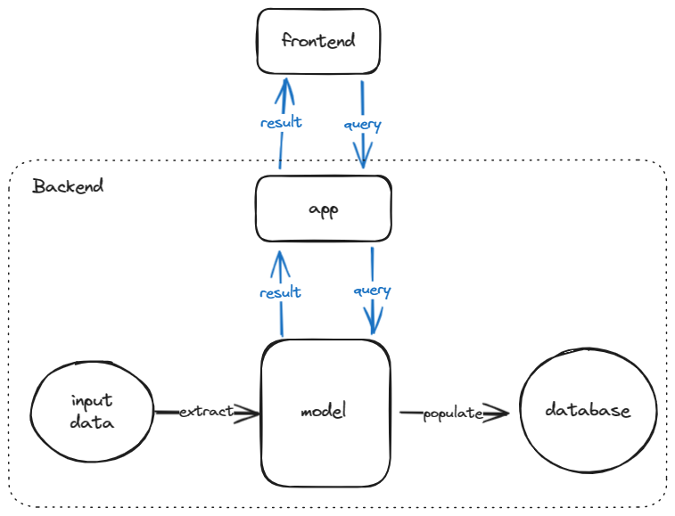

# Nerd Iconic Font Search

小呆字体图标搜索

a multilingual semantic search engine for nerd fonts glyphs


## Dependencies

```shell
# essential packages to run cloud embedding function
pip install -r requirement.txt

# additional packages to run local embedding function
pip install sentence-transformers

# additional packages to use cuda to run local embedding function
# see https://pytorch.org/
```

## Build locally

```shell
# build the database locally
#   assuming that the database `./model/chromadb` does NOT exist
python app.py

# upload the local database to remote server
#   We can build on Windows and upload to Ubuntu
scp -r .\model\chromadb\ $REMOTE_HOST:$PROJECT_PATH\model
```

## Run on server

```shell
# start server
#   assuming that the database `./model/chromadb` has already been uploaded
python app.py
```

## Design



## References

- [Nerdfonts Cheatsheet](https://www.nerdfonts.com/cheat-sheet)
- [Developing a Single Page App with FastAPI and React](https://testdriven.io/blog/fastapi-react/)
- [ChromaDB](https://docs.trychroma.com/)
- [Nodejs on Windows](https://learn.microsoft.com/zh-cn/windows/dev-environment/javascript/nodejs-on-windows)
