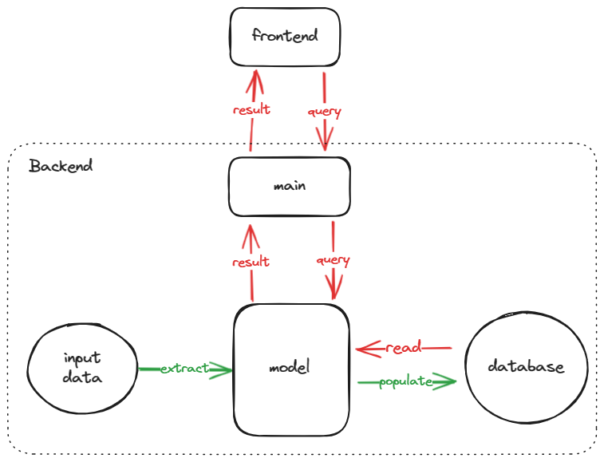

# Semantic Search



## Quick Start

```shell
# better to use the official repo
pip install -r requirements.txt -i https://pypi.org/simple
```

## References

- [Nerdfonts Cheatsheet](https://www.nerdfonts.com/cheat-sheet)
- [Developing a Single Page App with FastAPI and React](https://testdriven.io/blog/fastapi-react/)
- [ChromaDB](https://docs.trychroma.com/)
